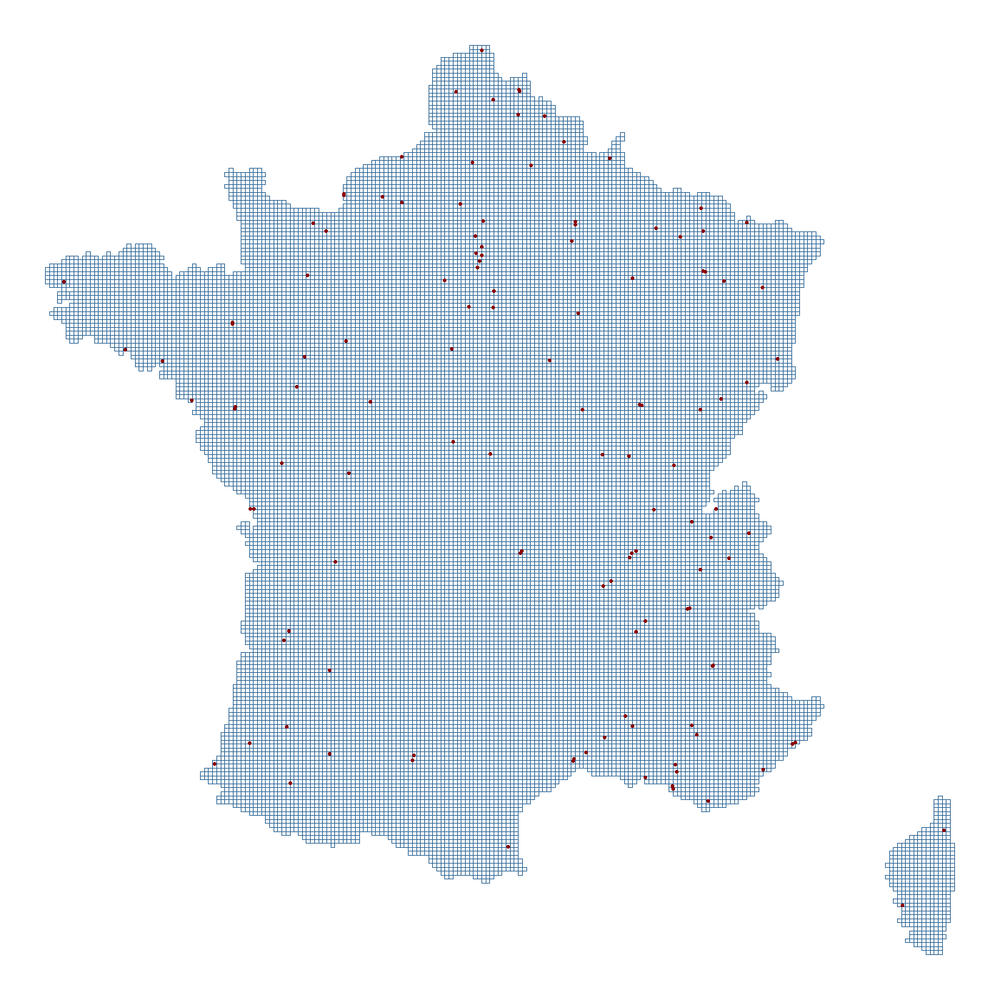

# Air-Quality

### Abstract

The forces that generate environmental phenomena are many and complex. Common
geo-statistical approaches to predicting such phenomena involve regressing on related
maps of land-use regressors, and interpolating observed samples across space and time.
In this paper, we review the method of unbiased, linear interpolation known as Kriging,
and apply it to a dataset of French PM2.5 readings in 2020. We harness the spatiotemporal dependencies of the pollution process with ordinary and residual Kriging methods to interpolate readings across the whole of Metropolitan France.

### Writeup Location 

./AQ-France.pdf

### Data scope

PM2.5 measurements were averaged daily for ~150 air quality sensors scattered across Metropolitan France.

Complementary spatial, temporal, or spatio-temporal environmental and land use features were collected from an assortment of government and open-source datasets to use in regression/residual Kriging interpolation.

### Methodology

Prediction methods included Ordinary (constant unknown mean) and Residual (nonconstant unknown mean) Kriging with various spatio-temporal semivariance functions used to approximate the dependencies of air pollution across space and time.

